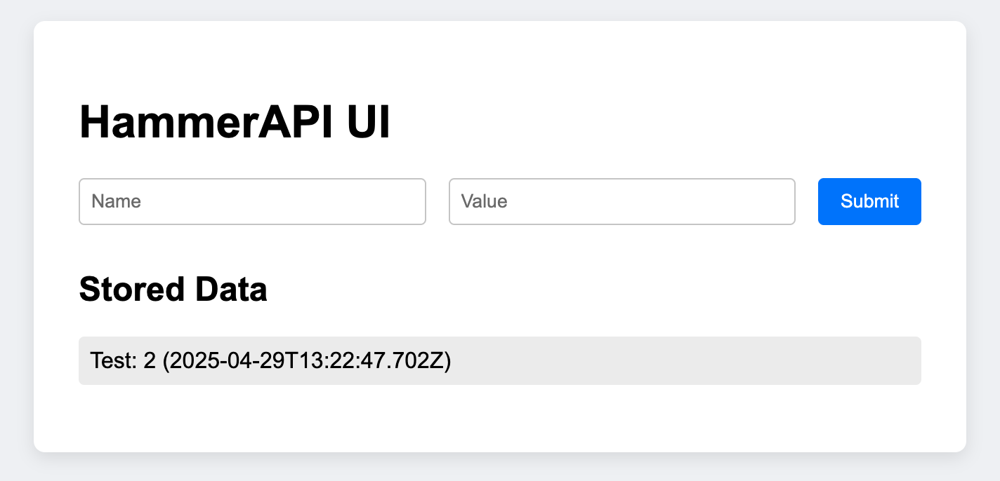

# Hammer API

Hammer API is a lightweight Node.js Express service with basic GET and POST endpoints, designed for local benchmarking performance testing tools like K6, Gatling, and Artillery. It also comes with a simple web UI and now supports persistent storage using **Apache Cassandra**.

## Features

- `GET /data`: Fetches all posted entries.
- `POST /data`: Adds new entries with a name and value.
- Simple UI which allows user input.
- **Cassandra database integration** for persistent storage.
- Automatically creates Keyspace and Table if not present.
- Built for benchmarking performance testing tools.

## Installation & Execution

```bash
git clone git@github.com:mahtabnejad90/hammer-api.git
cd hammer-api
npm install
docker run --name hammer-cassandra -p 9042:9042 -d cassandra:latest
npm start
```

## Usage

### POST Request

To utilise the post endpoint to create some basic data, just run the following command on your terminal

```bash
curl -X POST http://localhost:3000/data \
  -H "Content-Type: application/json" \
  -d '{"name": "Some Name", "value": "Random Value"}'
  ```

### UI

Here's an example on how the UI is represented with the user input ability as well as the data stored



### GET Request

Whilst server is still running and you have already created some data via the POST request method, open your browser and enter the follow url+endpoint to view the data create

http://localhost:3000/data

## Database Notes

- Uses Apache Cassandra via the official DataStax Node.js driver.
- Keyspace: hammerapi
- Table: data_entries
- Automatically created if missing on server startup.

To inspect your data:

```bash
docker exec -it hammer-cassandra cqlsh
USE hammerapi;
SELECT * FROM data_entries;
```

## Development/Testing Phases

- ~~Phase 1 > Create a simple API service with ability to POST and GET requests~~
- ~~Phase 2 > Create a simple UI which interacts directly with the API~~
- ~~Phase 3 > Add a database~~
- Phase 4 > Create performance scripts using different tooling
- Phase 5 > Generate baseline reports based on performance benchmarking of different tooling
- Phase 6 > Add Token-based Authentication